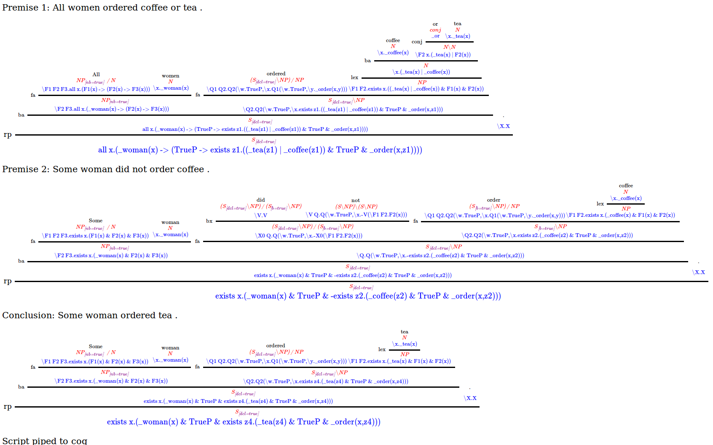

# ccg2lambda: composing semantic representations guided by CCG derivations

This is a tool to derive formal semantic representations of
natural language sentences given CCG derivation trees and semantic templates.

## Installation

In order to run most part of this software, it is necessary to install python3,
nltk 3, lxml, simplejson and yaml python libraries. I recommend to use a python virtual environment,
and install the packages in the virtual environment with `pip`:

```bash
sudo apt-get install python3-dev
sudo apt-get install python-virtualenv
sudo apt-get install libxml2-dev libxslt1-dev
git clone https://github.com/mynlp/ccg2lambda.git
cd ccg2lambda
virtualenv --no-site-packages --distribute -p /usr/bin/python3 py3
source py3/bin/activate
pip install lxml simplejson pyyaml -I nltk==3.0.5
```

You also need to install WordNet:

```bash
python -c "import nltk; nltk.download('wordnet')"
```

To ensure that all software is working as expected, you can run the tests:

```bash
python scripts/run_tests.py
```
(all tests should pass, except a few expected failures).

You also need to install the [Coq Proof Assistant](https://coq.inria.fr/) that we use for automated reasoning. In Ubuntu, you can install it by:

```bash
sudo apt-get install coq
```

Then, compile the coq library that contains the axioms:

```bash
coqc coqlib.v
```

Our system assigns semantics to CCG structures. At the moment, we support C&C for English, and Jigg for Japanese.

### Installing [C&C parser](http://www.cl.cam.ac.uk/~sc609/candc-1.00.html) (for English)

You can download and install the C&C syntactic parser by running the following script
from the ccg2lambda directory:

```bash
./en/install_candc.sh
```

If that fails, you may succeed by following [these alternative instructions](https://github.com/valeriobasile/learningbyreading#installation-of-the-cc-tools-and-boxer), in which case you need to manually create a file `en/candc_location.txt` with the path to the C&C parser:

```bash
echo "/path/to/candc-1.00/" > en/candc_location.txt
```

### Installing [Jigg parser](https://github.com/mynlp/jigg) (for Japanese)

Simply do:

```bash
./ja/download_dependencies.sh
```

The command above will download Jigg, its models, and create the file `ja/jigg_location.txt` where the path to Jigg is specified. That is all.

## Using the Semantic Parser

Let's assume that we have a file `sentences.txt` with one sentence per line,
and that we want to semantic parse those sentences. Here is the content of
my file:

```
All women ordered coffee or tea.
Some woman did not order coffee.
Some woman ordered tea.
```

And we want to obtain a symbolic semantic representation such as:

```
forall x. (woman(x) -> exists y. ((tea(y) \/ coffee(y)) /\ order(x, y)))
exists x. (woman(x) /\ -exists y. (cofee(y) /\ order(x, y)))
exists x. (woman(x) /\ exists y. (tea(y) /\ order(x, y)))
```

First we need to obtain the CCG derivations (parse trees) of the sentences
in the text file using C&C and convert its XML format into Jigg's XML format:

```bash
cat sentences.txt | sed -f en/tokenizer.sed > sentences.tok
/path/to/candc-1.00/bin/candc --models /path/to/candc-1.00/models --candc-printer xml --input sentences.tok > sentences.candc.xml
python en/candc2transccg.py sentences.candc.xml > sentences.xml
```

Then, we are ready to obtain the semantic representations by using semantic
templates and the CCG derivations obtained above:

```bash
python scripts/semparse.py sentences.xml en/semantic_templates_en_emnlp2015.yaml sentences.sem.xml
```

The semantic representations are in the `sentences.sem.xml` file,
where a new XML node `<semantics>` has been added with as many child nodes
as the CCG structure. Each semantic span has the logical representation
obtained up to that span. The root span has the logical representation
of the whole sentence. Here there is an excerpt of the semantics XML node
of the last sentence:

```xml
<semantics status="success" root="s2_sp0">
  <span id="s2_sp0" child="s2_sp1 s2_sp9" sem="exists x.(_woman(x) &amp; TrueP &amp; exists z4.(_tea(z4) &amp; TrueP &amp; _order(x,z4)))"/>
  <span id="s2_sp1" child="s2_sp2 s2_sp5" sem="exists x.(_woman(x) &amp; TrueP &amp; exists z4.(_tea(z4) &amp; TrueP &amp; _order(x,z4)))"/>
  <span id="s2_sp2" child="s2_sp3 s2_sp4" sem="\F2 F3.exists x.(_woman(x) &amp; F2(x) &amp; F3(x))"/>
  <span id="s2_sp3" sem="\F1 F2 F3.exists x.(F1(x) &amp; F2(x) &amp; F3(x))"/>
  <span id="s2_sp4" sem="\x._woman(x)" type="_woman : Entity -&gt; Prop"/>
  <span id="s2_sp5" child="s2_sp6 s2_sp7" sem="\Q2.Q2(\w.TrueP,\x.exists z4.(_tea(z4) &amp; TrueP &amp; _order(x,z4)))"/>
  <span id="s2_sp6" sem="\Q1 Q2.Q2(\w.TrueP,\x.Q1(\w.TrueP,\y._order(x,y)))" type="_order : Entity -&gt; Entity -&gt; Prop"/>
  <span id="s2_sp7" child="s2_sp8" sem="\F1 F2.exists x.(_tea(x) &amp; F1(x) &amp; F2(x))"/>
  <span id="s2_sp8" sem="\x._tea(x)" type="_tea : Entity -&gt; Prop"/>
  <span id="s2_sp9" sem="\X.X"/>
</semantics>
```

The `sem` attribute contains the logical formulas, and the `type` attributes
the types of the predicates (types only appear at the leaves).

## Using a prover (Coq) for recognizing textual entailment

We believe that the semantic representations above can be used
for several NLP tasks. We have been using them so far
for recognizing textual entailment. For this purpose,
we assume that all sentences in the file are premises,
except the last one, which is the conclusion.

To build a theorem out of those logical representations,
pipe it to a theorem prover (Coq) and judge the entailment
relation, you can run the following command:

```bash
python scripts/prove.py sentences.sem.xml --graph_out graphdebug.html
```

That command will output `yes` (entailment relation - the conclusion
can be proved given the premises), `no` (contradiction - the negated
conclusion can be proved), `unknown` (otherwise).

If the parsing process and theorem proving succeeded,
graphdebug.html will have a graphical representation
of the CCG trees, augmented with logical formulas at
every node below the syntactic category. The script
that pipes the theorem to Coq is also displayed at
the bottom. If the semantic parsing or prover fails,
graphdebug.html may contain plain debugging information
(e.g. python error messages, etc.). Here is the `graphdebug.html`
of the example above:



## Visualization

It is also possible to visualize CCG trees, either before
or after augmenting them with semantic representations.
For example, to visualize the CCG trees only (without
semantic representations):

```bash
python scripts/visualize.py sentences.xml > sentences.html
```

and then open the file `sentences.html` with your favourite web browser.
You should be able to see something like this:

")

## Reproducibility

If you wish to reproduce our reported results, please follow the instructions below:

* [Experiments on FraCaS at EMNLP 2015](en/fracas.md)
* [Experiments on JSeM at EMNLP 2016](ja/jsem.md)
* [Experiments on SICK at EACL 2017](en/sick.md)
* [Experiments on STS for SICK and MSRvid at EMNLP 2017](en/emnlp2017_sts.md)
* [Experiments on SICK at NAACL-HLT 2018](https://github.com/verypluming/ccg2lambda/blob/naacl/en/naacl2018.md)

## Interpreting (and writing your own) semantic templates.

You can find one of our semantic templates in `en/semantic_templates_en.yaml`. Here are some notes:

1. Each Yaml block is a rule. If the rule matches the attributes of a CCG node, then the semantic template specified by "semantics" is applied. It is possible to write an arbitrary set of field names and their values. For example, you could specify the "category" of the CCG node and the surface "surf" form of a word (in case the CCG node is a leaf). Only the "category" field and the "semantics" field are compulsory.
2. If you underspecify the characteristics of a CCG node, the semantic rule will match more general CCG nodes. It is also possible to underspecify the features of syntactic categories.
3. If more than one rule applies, only the last one in the file will be applied.
4. Any CCG node can be matched by the semantic rules.
  1. If the rule matches a CCG leaf node, then the base form (or surface form, if base not present) will be passed as the first argument to the lambda expression of the semantic template (specified by "semantics" field in Yaml rule).
  2. If the rule matches a CCG node with only one child, then the semantic expression of the child will be passed as the first argument to the semantic template assigned to this CCG node.
  3. If the rule matches a CCG node with two children, then the semantic expressions of the left and right children will be passed as the first and second argument to the semantic template of this CCG node, respectively.
5. Rules that are intended to match inner nodes of the CCG derivation need to specify either:
  1. A "rule" attribute, specifying what type of combination operation is there.
  2. A "child" attribute, specifying at least one attribute of one child (see next point).
6. You can specify in a semantic rule the characteristics of the children at the current CCG node. To that purpose, simply prefix the attribute name with "child0\_" or "child1\_" of the left or right child, respectively. E.g. if you want to specify the syntactic category of the left child, then you call such attribute in the semantic rule as "child0\_category". You can still underspecify the attributes of the children. If the CCG node only has one child, then it is considered a left child (and its attributes are specified using "child0\_" as a prefix).

# Citing this work

If you use this software or the semantic templates for your work, please consider citing it.

## The system - software for compositional semantics:

* Pascual Martínez-Gómez, Koji Mineshima, Yusuke Miyao, Daisuke Bekki. ccg2lambda: A Compositional Semantics System. Proceedings of the 54th Annual Meeting of the Association for Computational Linguistics - System Demonstrations, pages 85–90, Berlin, Germany, August 7-12, 2016. [pdf](https://aclweb.org/anthology/P/P16/P16-4015.pdf)

```
@InProceedings{pascual-EtAl:2016:ACL-2016-System-Demonstrations,
  author    = {Mart\'{i}nez-G\'{o}mez, Pascual and Mineshima, Koji and Miyao, Yusuke and Bekki, Daisuke},
  title     = {ccg2lambda: A Compositional Semantics System},
  booktitle = {Proceedings of ACL 2016 System Demonstrations},
  month     = {August},
  year      = {2016},
  address   = {Berlin, Germany},
  publisher = {Association for Computational Linguistics},
  pages     = {85--90},
  url       = {https://aclweb.org/anthology/P/P16/P16-4015.pdf}
}
```

## A system to inject phrasal axioms on-demand (phrase abduction):

 * Hitomi Yanaka, Koji Mineshima, Pascual Martínez-Gómez and Daisuke Bekki. Acquisition of Phrase Correspondences using Natural Deduction Proofs. Proceedings of 16th Annual Conference of the North American Chapter of the Association for Computational Linguistics: Human Language Technologies, New Orleans, Louisiana, 1-6 June 2018. [arXiv](https://arxiv.org/pdf/1804.07656.pdf)

 ```
 @InProceedings{yanaka-EtAl:2018:NAACL-HLT,
   author    = {Yanaka, Hitomi and Mineshima, Koji  and  Mart\'{i}nez-G\'{o}mez, Pascual  and  Bekki, Daisuke},
   title     = {Acquisition of Phrase Correspondences using Natural Deduction Proofs},
   booktitle = {Proceedings of 16th Annual Conference of the North American Chapter of the Association for Computational Linguistics: Human Language Technologies},
   month     = {June},
   year      = {2018},
   address   = {New Orleans, Louisiana},
   publisher = {Association for Computational Linguistics},
 }
 ```

## A system to compute Semantic Sentence Similarity:

* Hitomi Yanaka, Koji Mineshima, Pascual Martínez-Gómez and Daisuke Bekki. Determining Semantic Textual Similarity using Natural Deduction Proofs. Proceedings of the 2017 Conference on Empirical Methods in Natural Language Processing, Copenhagen, Denmark, 7-11 September 2017. [arXiv](https://arxiv.org/pdf/1707.08713.pdf)

```
@InProceedings{yanaka-EtAl:2017:EMNLP,
  author    = {Yanaka, Hitomi and Mineshima, Koji  and  Mart\'{i}nez-G\'{o}mez, Pascual  and  Bekki, Daisuke},
  title     = {Determining Semantic Textual Similarity using Natural Deduction Proofs},
  booktitle = {Proceedings of the 2017 Conference on Empirical Methods in Natural Language Processing},
  month     = {September},
  year      = {2017},
  address   = {Copenhagen, Denmark},
  publisher = {Association for Computational Linguistics},
}
```


## A mechanism to inject axioms on-demand:

* Pascual Martínez-Gómez, Koji Mineshima, Yusuke Miyao, Daisuke Bekki. On-demand Injection of Lexical Knowledge for Recognising Textual Entailment. Proceedings of the 15th Conference of the European Chapter of the Association for Computational Linguistics, pages 710-720, Valencia, Spain, 3-7 April, 2017. [pdf](http://www.aclweb.org/anthology/E17-1067)

```
@InProceedings{martinezgomez-EtAl:2017:EACLlong,
  author    = {Mart\'{i}nez-G\'{o}mez, Pascual  and  Mineshima, Koji  and  Miyao, Yusuke  and  Bekki, Daisuke},
  title     = {On-demand Injection of Lexical Knowledge for Recognising Textual Entailment},
  booktitle = {Proceedings of the 15th Conference of the European Chapter of the Association for Computational Linguistics: Volume 1, Long Papers},
  month     = {April},
  year      = {2017},
  address   = {Valencia, Spain},
  publisher = {Association for Computational Linguistics},
  pages     = {710--720},
  url       = {http://www.aclweb.org/anthology/E17-1067}
}
```

## The English semantic model declared as semantic templates:

* Koji Mineshima, Pascual Martínez-Gómez, Yusuke Miyao, Daisuke Bekki. Higher-order logical inference with compositional semantics. Proceedings of the 2015 Conference on Empirical Methods in Natural Language Processing, pages 2055–2061, Lisbon, Portugal, 17-21 September 2015. [pdf](http://www.aclweb.org/anthology/D15-1244)

```
@InProceedings{mineshima-EtAl:2015:EMNLP,
  author    = {Mineshima, Koji  and  Mart\'{i}nez-G\'{o}mez, Pascual  and  Miyao, Yusuke  and  Bekki, Daisuke},
  title     = {Higher-order logical inference with compositional semantics},
  booktitle = {Proceedings of the 2015 Conference on Empirical Methods in Natural Language Processing},
  month     = {September},
  year      = {2015},
  address   = {Lisbon, Portugal},
  publisher = {Association for Computational Linguistics},
  pages     = {2055--2061},
  url       = {http://aclweb.org/anthology/D15-1244}
}
```

## The Japanese semantic model declared as semantic templates:

* Koji Mineshima, Ribeka Tanaka, Pascual Martínez-Gómez, Yusuke Miyao, Daisuke Bekki. Building compositional semantics and higher-order inference system for wide-coverage Japanese CCG parsers. Proceedings of the 2016 Conference on Empirical Methods in Natural Language Processing, pages 2236-2242, Austin, Texas, 1-5 November 2016. [pdf](http://aclweb.org/anthology/D16-1242)

```
@InProceedings{D16-1242,
  author = 	"Mineshima, Koji
		and Tanaka, Ribeka
		and Mart{\'i}nez-G{\'o}mez, Pascual
		and Miyao, Yusuke
		and Bekki, Daisuke",
  title = 	"Building compositional semantics and higher-order inference system for a wide-coverage {J}apanese {CCG} parser",
  booktitle = 	"Proceedings of the 2016 Conference on Empirical Methods in Natural Language Processing",
  year = 	"2016",
  publisher = 	"Association for Computational Linguistics",
  pages = 	"2236--2242",
  location = 	"Austin, Texas",
  url = 	"http://aclweb.org/anthology/D16-1242"
}
```
